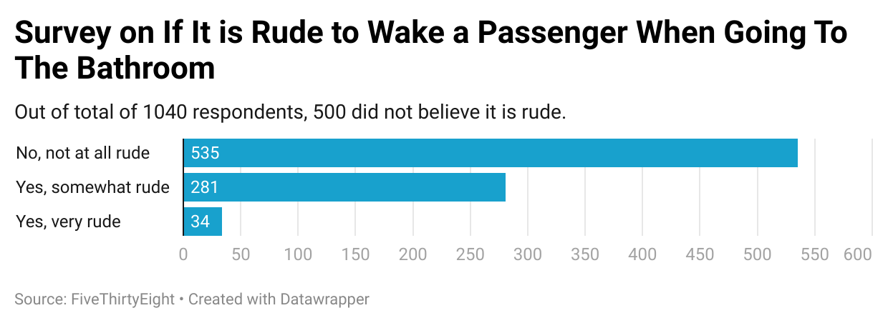

# flying-
I picked the question above because as someone who drinks a lot of water and frequently uses the bathroom, I was interested in knowing if it [waking someone so you may use the bathroom]  is considered rude by a signficant amount of passengers.
While I expected the majoirty of respondents to not find it rude, I was surpising to see that a signficant amount of people found it somewhat rude. 
The chart reveals that a very small amount of respondents said "yes, very rude", while the vast majority of respondents said it is not rude or only somewhat rude.  

